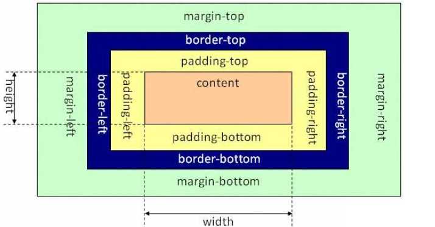
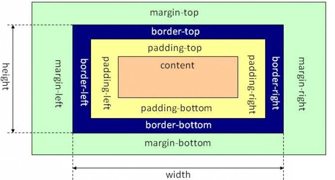

# CSS盒模型简述

CSS的盒模型是CSS的基础，同时也是难点，经常会在面试中被问到。

所谓的盒模型可以认为每个html标签都是一个方块，然后这个方块又包着几个小方块，如同盒子一层层的包裹着。

盒模型分为IE盒模型（border-box）和W3C标准盒模型（content-box）

## 1.W3C标准盒模型

属性width只包含content，不包含border和padding。



## 2.IE盒模型

属性width包含border和padding（content+border+padding）。



【补充】一般使用盒模型优先使用border-box，方便计算盒子在网页中所占尺寸。

## margin合并

```CSS
/*兄弟元素1*/
.div1{
background-color:pink;
height:20px;
margin-bottom:50px;
}

/*兄弟元素2*/
.div2{
background-color:red;
height:20px;
margin-top:50px;
}
```
想象中的情况是div1与div2中间间距的距离应该是100px；实际如下:


通过上图我们会发现div1：margin-bottom与div1：margin-top之间发生了合并。

## 阻止margin合并的方法

1.父子合并用padding/border
2.父子合并用overflow：hidden
3.父子合并用display：fiex
4.兄弟合并可以用inline-block消除

以上就是我对于盒模型和margin合并的理解，如有问题请留言告知。


